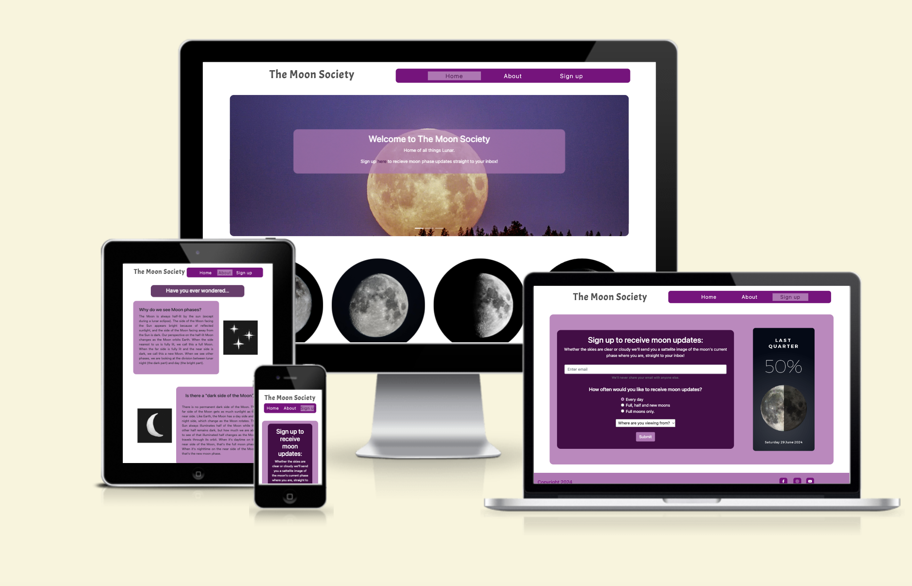
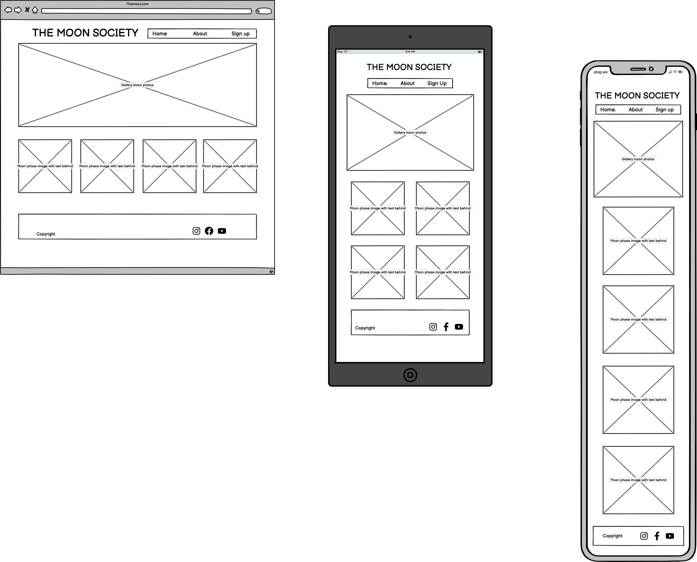
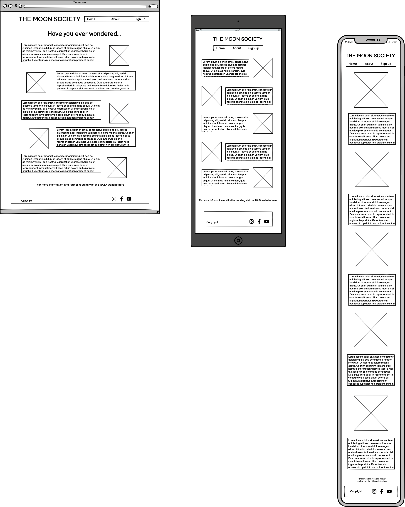
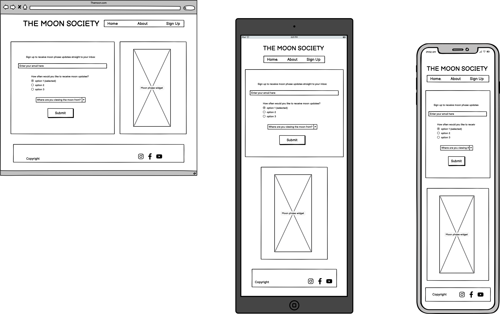

# The Moon Society

[Live site](https://jahooli4.github.io/Moon/)

The Moon Society is a site that provides facts about the moon presented in a fun way. The site is aimed at users who wish to find out information about the moon, particularly it's different phases and why we see them. Users also have the opption to sign up to an email newsletter that sends out the current phase of the moon to their inbox, this way they can stay up to date on the moon in all weather condtions.

## User Experience (UX)

 ### **User stories:**

#### User
  > - As a user I want to be able to navigate the site easily and access the navigation menu from all pages.
  > - As a user I want to be able to find out information about the moon.
  > - As a user I want to be able to understand why we see different phases of the moon.
  > - As a user I want to be able to see the current phase of the moon.
  > - As a user I want to be able to subscribe to receive updates of the moon's current phase to my email inbox.

#### Website Owner
  > - As the site owner I want to provide information for my users in a fun and interesting way.
  > - As the site owner I want to provide a daily updated moon phase calendar for my users.
  > - As the site owner I want to create leads and provide users with a link to find out more information about the moon.
  > - As the site owner I want to use this website to provide users with a subscription service to receive moon phase updates.

#### Scope Plane
  > - The website should have a Navigation menu that is consistent across all pages and devices and clearly illustrates which page the user is currently on.
  > - The website should have a welcome message for the user that concisely describes the purpose of the site.
  > - The website should display facts about the moon in a visually stimulating way.
  > - The website should show the current phase of the moon.
  > - The website should give the user a way to sign up to receive moon phase updates as often as they choose.
  > - The website should give the user a link to further reading about the moon.

#### Structure Plane
Home
> - Site logo
> - Navigation bar with links
> - Hero image carousel featuring moon landscape images.
> - Welcome message with brief site description
> - Short facts about the moon displayed in a visually interesting way, ie flip cards that animate when hovered over
> - Footer section with links to social media

About
> - Navigation bar with links
> - Frequently asked questions about the moon
> - FAQ's should be paired with illustrations to break up the page and avoid information overload
> - A link to an external site should be provided for extra reading should the user wish to find out more information

Sign Up

> - The Sign up page should have a sign up form for the user to receive moon phase updates
> - The form should collect an email address for the user
> - The form should include an option for the user to select how often they wish to receive updates 
> - The form should include an option for the user to select whether they are in the Northerm or Southern hemisphere
> - The sign up pages should include a card that updates daily with the current moon phase

#### Wire frames:
  Home page wireframes:
  
  
  

