# The Moon Society

[Live site](https://jahooli4.github.io/Moon/)

The Moon Society is a site that provides facts about the moon presented in a fun way. The site is aimed at users who wish to find out information about the moon, particularly it's different phases and why we see them. Users also have the opption to sign up to an email newsletter that sends out the current phase of the moon to their inbox, this way they can stay up to date on the moon in all weather condtions.

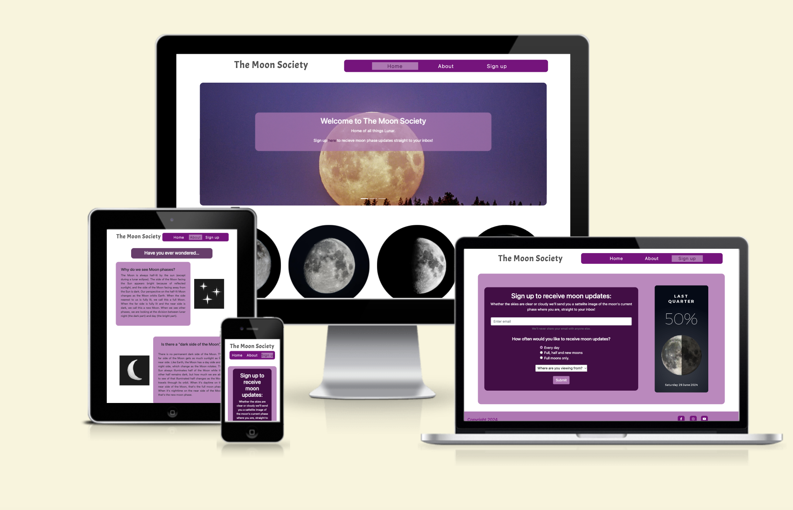

## User Experience (UX)

 ### **User stories:**

### User
  > - As a user I want to be able to navigate the site easily and access the navigation menu from all pages.
  > - As a user I want to be able to find out information about the moon.
  > - As a user I want to be able to understand why we see different phases of the moon.
  > - As a user I want to be able to see the current phase of the moon.
  > - As a user I want to be able to subscribe to receive updates of the moon's current phase to my email inbox.

### Website Owner
  > - As the site owner I want to provide information for my users in a fun and interesting way.
  > - As the site owner I want to provide a daily updated moon phase calendar for my users.
  > - As the site owner I want to create leads and provide users with a link to find out more information about the moon.
  > - As the site owner I want to use this website to provide users with a subscription service to receive moon phase updates.

### Scope Plane
  > - The website should have a Navigation menu that is consistent across all pages and devices and clearly illustrates which page the user is currently on.
  > - The website should have a welcome message for the user that concisely describes the purpose of the site.
  > - The website should display facts about the moon in a visually stimulating way.
  > - The website should show the current phase of the moon.
  > - The website should give the user a way to sign up to receive moon phase updates as often as they choose.
  > - The website should give the user a link to further reading about the moon.

### Structure Plane
Home
> - Site logo
> - Navigation bar with links
> - Hero image carousel featuring moon landscape images.
> - Welcome message with brief site description
> - Short facts about the moon displayed in a visually interesting way, ie flip cards that animate when hovered over
> - Footer section with links to social media

About
> - Navigation bar with links
> - Frequently asked questions about the moon
> - FAQ's should be paired with illustrations to break up the page and avoid information overload
> - A link to an external site should be provided for extra reading should the user wish to find out more information

Sign Up

> - The Sign up page should have a sign up form for the user to receive moon phase updates
> - The form should collect an email address for the user
> - The form should include an option for the user to select how often they wish to receive updates 
> - The form should include an option for the user to select whether they are in the Northerm or Southern hemisphere
> - The sign up pages should include a card that updates daily with the current moon phase

### Wire frames:
  Home page wireframes:
  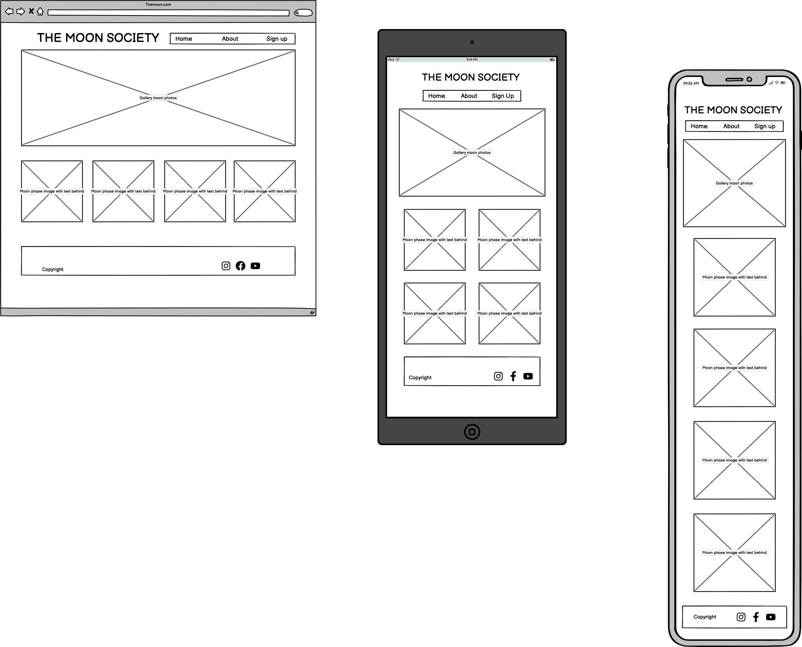
  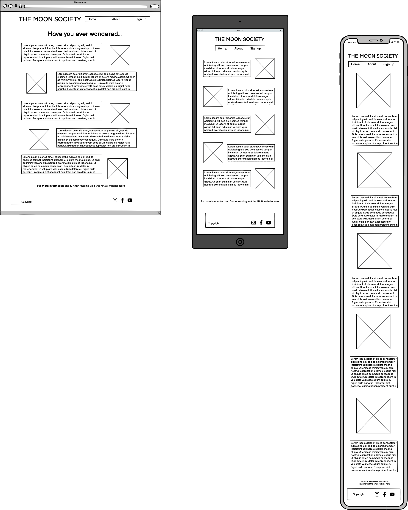
  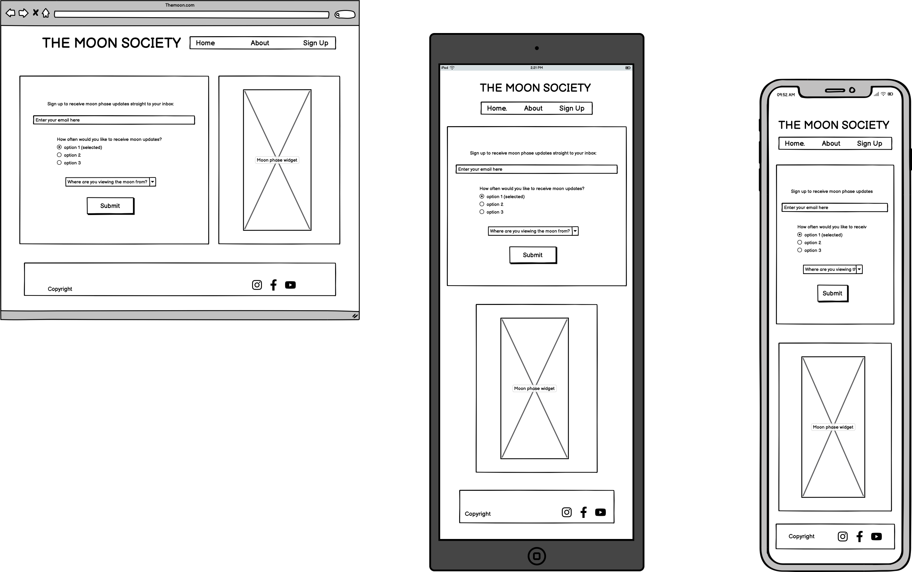

The site has been designed to be as user friendly as possible, utilising a classic layout style with navigation bar and logo at the top, content inbetween, and footer with external social media links at the bottom. The layout has been made as consistent as possible across all devices, with elements only rearranging to provide optimised viewing.

  ### Surface plane

  **Color:**
  After exploring other space themed sites that already exist on the Web and finding most of them follow a black and white color scheme, I decided I wanted my site to have a pop of colour and have a slightly more mystical feel to it. I decided to opt for a purple palette to match one of my hero photos sunset tones.
  > - `#fafafa` White
  > - `rgb(128, 0, 128)` Purple
  > - `rgb(72, 7, 72)` Darker purple
  > - `#1b1b1b` Charcoal/Black

  **Font:**
  I opted for Roboto for the main body of my site and just used Acme for the logo to provide a contrast. I like the sort of bubbl;e effect of Acme and thought the soft roundness of it lended itself well to the moon theme.

  ## Existing Features
>- ### index.html
   #### Navigation bar: 

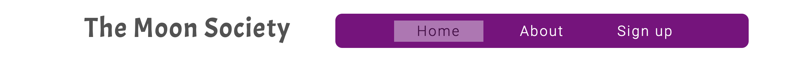
The nav bar and logo were created using bootstrap columns and inline list items. I have styled them with hover pseudo classes so the user can tell they are active links. The menu item tab also changes colour depending on which page is active so the user knows which they are currently on.

#### Hero section:

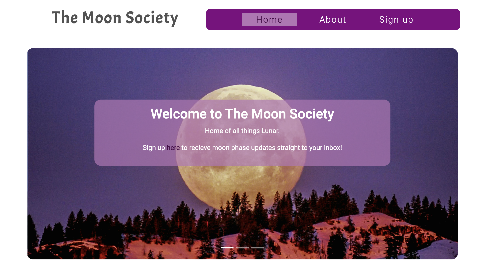
For the hero image section I decided to use an image carousel that slides through 3 different images on a timer. I have also included indicators so the user may switch between the images at will without having to wait for the timer to change. I have also added a welcome message that gives the user an idea of what the website is about. Underneath the welcome message is an invitation and link to the sign up page to fast track users in the direction. 

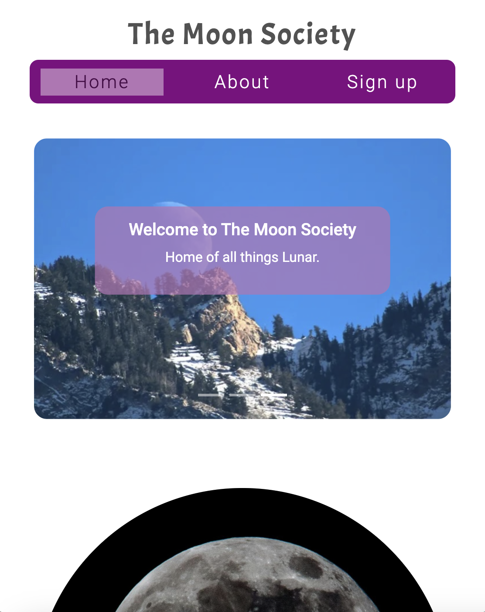
On small devices and below I decided the inclusion of the sign up message made the hero section look too cluttered so set the display to 'none' at sm and smaller.

#### Flip card section: 

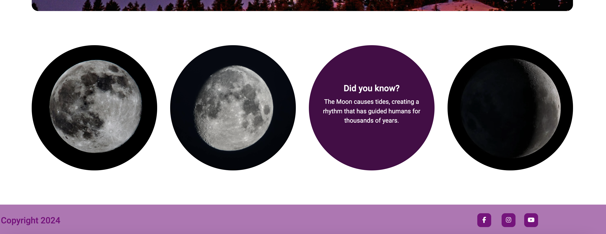 
It made sense to include a few initial facts on the home page to make it clear to the user the purpose of the site. To avoid the page looking boring and full of text I decided to conceal these behind flip card images that flip and reaveal the facts when hovered over. This adds an interactive element which keeps the user intested and engaged.

#### Footer section:

The footer has been designed in a minimalistic way as the only information In felt relevant to include here are the social media icon links. These have been styled to change colour when hovered over to make it clear to the user they are active links. The links open in a new page so users don't get taken away from my site.

### about.html

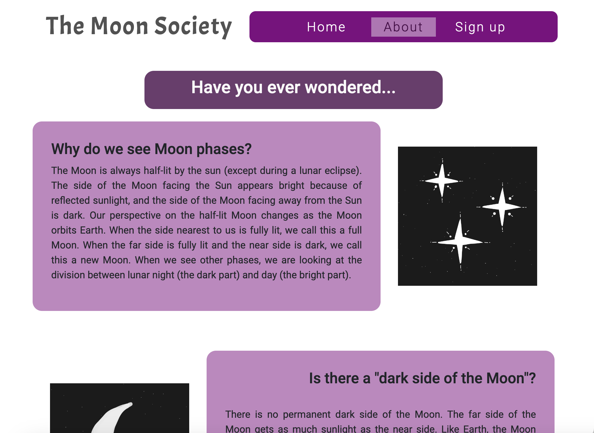
The about page is the main information source of the site. Here I have compiled a list of FAQ's about the moon. I decided to give the text containers lilac backgrounds to add a pop of colour and added space themed illustrations alongside to add an element of visual interest and break up the blocks of text.

### signup.html

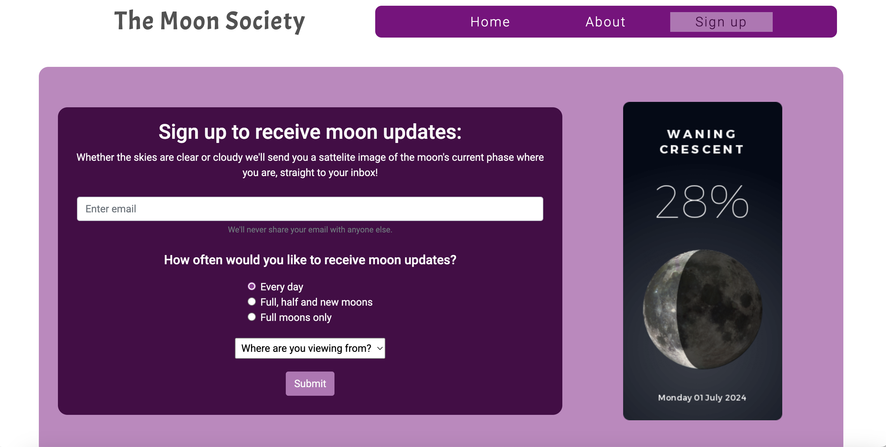

#### Sign up form

My sign up form gives users the oppurtunity to sign up to an email newsletter providing them with the current phase of the moon. This will appeal to moon enthusiasts for both academic and recreational purposes. I decided to include a radio button section so that the user can choose how often they receive updates. I thought just offering daily updates as an option might put off some users as they might feel it would clutter up their inbox. I have also included a drop down menu selector for the user to select which heisphere they are in to ensure they receive an accurate reading of the moon.
All of the form fields have a 'required' attribute so they cannot be left blank. The email field is also set to email format to ensure users enter a correctly formatted email address.

#### Moon phase widget

To give the user an example of what they are signing to up for I decided to include a moon phase widget that shows the current phase of the moon based on the date. This is also a handy feature for any users just wishing to find out this information without signing up to the newsletter. 

### success.html

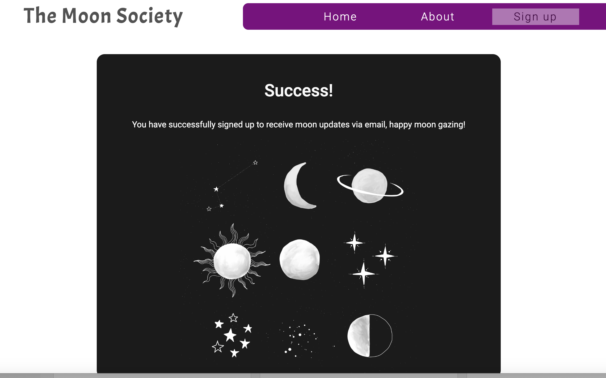
To let the user know they have successfully submitted their information via the sign up form I opted to create an extra page with a success message. I also added a space illustration to add a fun visual element, this ties in nicely with the ones on my about page which I think makes it nice and cohesive.

## Future Features
### Home page
> - I would like to include an interactive map of the night sky that would show the users the moon and constellations above them where they are. 
### About page
> - A potential feature to add to the about page could be a search box in which users could type any questions they may have and the answer would be presented to them. This would be a good upgrade compared tp having to scroll down the page to find info they may be looking for.
### Sign up page
> - The first priority would be to get the back end up and running for my sign up form so users actually receive the moon phase emails they are signing up to.
### Additional pages
> - In the future I would plan to add a moon calendar page that shows a monthly view of the moons phases. Users would be able to select the days to see more in depth info about that day's moon.
> - I would also like to add a page about full moons and the different names they have depending on the month.

## Languages used

> - HTML5
> - CSS3

## Technologies used
> - Google Fonts: The font 'Roboto' was used for the main body of the site. The font 'Acme' was used for the Logo.
> - Font Awesome: was used to import icons into the footer for the social media links.
> - Git: I used Gitpod as a code space to create the site from which I pushed my site to Github for deployment.
> - GitHub: I used GitHub as the respository for the projects code after being pushed from Gitpod.
> - Balsamiq: I used Balsamiq to create wireframes to outline to design of the site.

## Testing

